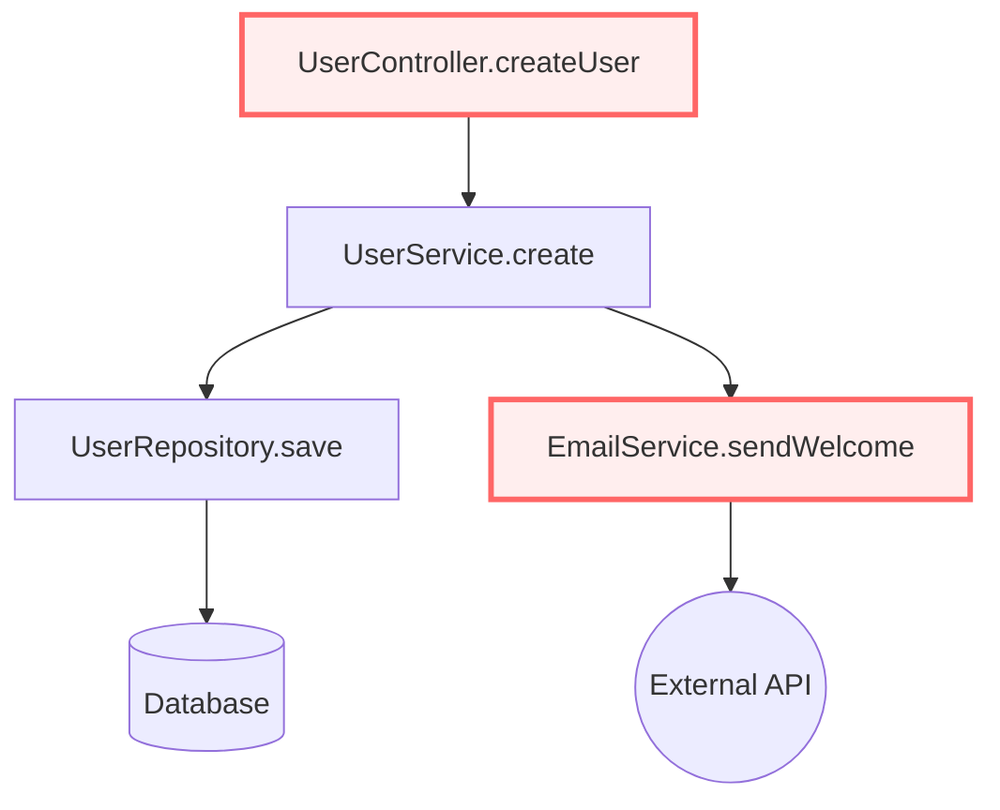

# Story 8.5: 实现审查报告可视化组件

Status: review

## Story

As a 开发者,
I want 在 Web 界面看到可视化的审查报告,
so that 更直观地理解代码问题，快速定位关键问题并采取行动。

## Acceptance Criteria

1. **问题列表组件（IssueList.vue）**：可复用组件，接受 `issues` 数组作为 prop，渲染问题卡片布局
2. **严重性徽章**：Critical（红色）、High（橙色）、Medium（黄色）、Low（蓝色）、Info（灰色）徽章
3. **代码行号链接**：点击行号跳转到 CodeSnippet 组件，高亮显示对应行
4. **修复建议展开/收起**：问题卡片默认显示简要信息，点击「查看详情」展开完整描述和修复建议
5. **代码片段组件（CodeSnippet.vue）**：使用 Prism.js 进行语法高亮，显示行号，问题行高亮标记（红色背景 + 波浪下划线）
6. **复制代码按钮**：CodeSnippet 右上角提供复制按钮，点击复制代码到剪贴板，显示「已复制」提示
7. **调用链路图组件（CallGraphChart.vue）**：使用 Mermaid.js 渲染调用链路图，支持节点点击查看方法详情
8. **D3.js 交互式图表（可选增强）**：提供缩放、拖拽、节点高亮功能，高亮变更节点（红色边框）
9. **统计图表组件（StatisticsChart.vue）**：使用 ECharts 渲染饼图（按严重性分布）、柱状图（按类别分布）、趋势图（历史审查统计）
10. **组件响应式设计**：所有组件支持桌面端（> 1024px）、平板端（768-1024px）、移动端（< 768px）适配
11. **组件可复用性**：所有组件设计为独立、可复用，可在 ReviewDetail 页面（Story 8.2）和其他页面中使用

## Tasks / Subtasks

- [ ] Task 1: 创建问题列表组件 (AC: #1, #2, #3, #4, #10, #11)
  - [ ] 1.1 创建 `src/components/review/IssueList.vue`：定义 TypeScript 接口（Issue, IssueListProps）
  - [ ] 1.2 实现问题卡片布局（ElCard + 严重性徽章 + 标题 + 简要描述）
  - [ ] 1.3 实现严重性徽章组件（SeverityBadge.vue，颜色映射）
  - [ ] 1.4 实现行号链接（点击触发 `@line-click` 事件，传递行号和文件路径）
  - [ ] 1.5 实现修复建议展开/收起（ElCollapse 或自定义展开动画）
  - [ ] 1.6 实现响应式布局（移动端单列，桌面端多列）

- [ ] Task 2: 创建代码片段组件 (AC: #5, #6, #10, #11)
  - [ ] 2.1 安装 Prism.js（`pnpm add prismjs @types/prismjs`）
  - [ ] 2.2 创建 `src/components/review/CodeSnippet.vue`：接受 `code`, `language`, `highlightLines` props
  - [ ] 2.3 实现 Prism.js 语法高亮（支持常见语言：Java, JavaScript, TypeScript, Python, Go, C#, Ruby, PHP, SQL）
  - [ ] 2.4 实现行号显示（计算行数，显示左侧行号列）
  - [ ] 2.5 实现问题行高亮（红色背景 + 波浪下划线，基于 `highlightLines` prop）
  - [ ] 2.6 实现复制代码按钮（ElButton + 剪贴板 API，点击后显示「已复制」提示 1.5 秒）
  - [ ] 2.7 实现响应式设计（移动端代码横向滚动，桌面端自动换行）

- [ ] Task 3: 创建调用链路图组件 (AC: #7, #8, #10, #11)
  - [ ] 3.1 安装 Mermaid.js（`pnpm add mermaid @types/mermaid`）
  - [ ] 3.2 创建 `src/components/chart/CallGraphChart.vue`：接受 `graphData` prop（Mermaid 语法字符串）
  - [ ] 3.3 实现 Mermaid 图表渲染（使用 `mermaid.render()` API）
  - [ ] 3.4 实现节点点击事件（监听 Mermaid 节点点击，触发 `@node-click` 事件）
  - [ ] 3.5 实现图表容器自适应（根据父容器宽度调整图表大小）
  - [ ] 3.6 （可选）实现 D3.js 交互式图表备选方案（缩放、拖拽、节点高亮）

- [ ] Task 4: 创建统计图表组件 (AC: #9, #10, #11)
  - [ ] 4.1 安装 ECharts（`pnpm add echarts`）
  - [ ] 4.2 创建 `src/components/chart/StatisticsChart.vue`：接受 `chartType`, `data` props
  - [ ] 4.3 实现饼图（按严重性分布）：Critical（红）、High（橙）、Medium（黄）、Low（蓝）、Info（灰）
  - [ ] 4.4 实现柱状图（按类别分布）：Security、Performance、Quality、Style、Bug、CallGraph
  - [ ] 4.5 实现趋势图（历史审查统计）：时间轴（X轴）+ 问题数量（Y轴），多条折线（按严重性区分）
  - [ ] 4.6 实现图表响应式（监听容器尺寸变化，调用 `chart.resize()`）
  - [ ] 4.7 实现图表交互（tooltip、legend 点击切换、数据缩放）

- [ ] Task 5: 创建严重性徽章组件 (AC: #2, #11)
  - [ ] 5.1 创建 `src/components/review/SeverityBadge.vue`：接受 `severity` prop
  - [ ] 5.2 实现颜色映射（Critical=red, High=orange, Medium=yellow, Low=blue, Info=gray）
  - [ ] 5.3 实现图标映射（使用 lucide-icons，Critical=AlertCircle, High=AlertTriangle, Medium=Info, Low=CheckCircle）
  - [ ] 5.4 实现尺寸变体（small, default, large）

- [ ] Task 6: 组件 TypeScript 类型定义 (AC: #11)
  - [ ] 6.1 创建 `src/types/review.ts`：定义 Issue, ReviewIssue, CallGraphNode, ChartData 接口
  - [ ] 6.2 创建 `src/types/chart.ts`：定义 EChartsOption, MermaidGraphData, D3GraphData 接口

- [ ] Task 7: 组件单元测试 (AC: #11)
  - [ ] 7.1 编写 IssueList.vue 单元测试（Vitest + @vue/test-utils）
  - [ ] 7.2 编写 CodeSnippet.vue 单元测试（测试语法高亮、行号、复制功能）
  - [ ] 7.3 编写 CallGraphChart.vue 单元测试（测试 Mermaid 渲染、节点点击）
  - [ ] 7.4 编写 StatisticsChart.vue 单元测试（测试 ECharts 初始化、数据更新）

- [ ] Task 8: 组件 Storybook 文档（可选）
  - [ ] 8.1 安装 Storybook（`pnpm add -D @storybook/vue3`）
  - [ ] 8.2 编写 IssueList.stories.ts（展示不同严重性、不同问题数量的场景）
  - [ ] 8.3 编写 CodeSnippet.stories.ts（展示不同语言、不同高亮行的场景）
  - [ ] 8.4 编写 CallGraphChart.stories.ts（展示不同复杂度的调用图）
  - [ ] 8.5 编写 StatisticsChart.stories.ts（展示饼图、柱状图、趋势图）

- [ ] Task 9: 国际化 (AC: 全部)
  - [ ] 9.1 在 `src/locales/langs/en-US/review.json` 添加审查报告可视化相关翻译
  - [ ] 9.2 在 `src/locales/langs/zh-CN/review.json` 添加审查报告可视化相关翻译

## Dev Notes

### 🎯 Story 8.5 核心目标

**业务价值**：为 Story 8.2（审查历史查看界面）提供可复用的可视化组件，使开发者能够在 **3 秒内**看到首屏关键问题，**10 秒内**理解问题本质，**30 秒内**知道如何修复。

**技术价值**：建立企业级可复用组件库，为后续功能（如实时审查、问题追踪、团队报告）奠定基础。

**UX 设计原则**：
1. **信息层次清晰**：Critical 问题优先，使用视觉层次（颜色、尺寸、位置）引导注意力
2. **上下文完整**：代码片段包含上下文（问题行 ± 5 行），调用图展示完整调用链路
3. **操作直观**：点击行号跳转代码，点击节点查看详情，无需学习成本
4. **性能优先**：虚拟滚动（1000+ 问题）、懒加载（代码片段）、图表按需渲染

---

### 📦 TypeScript 接口定义

#### 核心数据结构

```typescript
// src/types/review.ts

/**
 * 审查问题（与后端 ReviewIssueDTO 对应）
 */
export interface ReviewIssue {
  id?: number;                      // 问题 ID（可选，用于持久化）
  file: string;                     // 文件路径（如 "src/main/java/com/example/UserService.java"）
  line: number;                     // 问题行号
  lineEnd?: number;                 // 结束行号（多行问题）
  severity: IssueSeverity;          // 严重性
  category: IssueCategory;          // 类别
  message: string;                  // 问题描述
  suggestion?: string;              // 修复建议
  codeSnippet?: string;             // 代码片段（可选，按需加载）
  context?: string;                 // 上下文信息（如函数名、类名）
}

/**
 * 问题严重性
 */
export type IssueSeverity = 'CRITICAL' | 'HIGH' | 'MEDIUM' | 'LOW' | 'INFO';

/**
 * 问题类别
 */
export type IssueCategory =
  | 'SECURITY'          // 安全性
  | 'PERFORMANCE'       // 性能
  | 'QUALITY'           // 代码质量
  | 'STYLE'             // 代码风格
  | 'BUG'               // 潜在 Bug
  | 'BEST_PRACTICE';    // 最佳实践

/**
 * 调用链路节点
 */
export interface CallGraphNode {
  id: string;                       // 节点 ID（唯一标识）
  label: string;                    // 节点标签（方法名）
  type: 'method' | 'class' | 'external'; // 节点类型
  file?: string;                    // 文件路径
  line?: number;                    // 行号
  isChanged?: boolean;              // 是否为变更节点（高亮显示）
}

/**
 * 调用链路边
 */
export interface CallGraphEdge {
  source: string;                   // 源节点 ID
  target: string;                   // 目标节点 ID
  label?: string;                   // 边标签（如调用次数）
}

/**
 * 调用链路图数据
 */
export interface CallGraphData {
  nodes: CallGraphNode[];           // 节点列表
  edges: CallGraphEdge[];           // 边列表
  mermaidSyntax?: string;           // Mermaid 语法字符串（优先使用）
}

/**
 * 统计图表数据
 */
export interface StatisticsData {
  severityDistribution: {           // 按严重性分布
    [K in IssueSeverity]: number;
  };
  categoryDistribution: {           // 按类别分布
    [K in IssueCategory]: number;
  };
  trendData?: {                     // 历史趋势数据（可选）
    date: string;                   // 日期（ISO 8601）
    counts: {
      [K in IssueSeverity]: number;
    };
  }[];
}
```

#### 组件 Props 接口

```typescript
// src/components/review/IssueList.vue Props
export interface IssueListProps {
  issues: ReviewIssue[];            // 问题列表
  loading?: boolean;                // 加载状态
  defaultSeverity?: IssueSeverity | 'ALL'; // 默认筛选严重性
  showFilters?: boolean;            // 是否显示筛选工具栏
  virtualScroll?: boolean;          // 是否启用虚拟滚动（默认 true）
}

// src/components/review/CodeSnippet.vue Props
export interface CodeSnippetProps {
  code: string;                     // 代码内容
  language: string;                 // 编程语言（如 "java", "typescript"）
  highlightLines?: number[];        // 高亮行号数组（如 [42, 43, 44]）
  startLine?: number;               // 起始行号（默认 1）
  showLineNumbers?: boolean;        // 是否显示行号（默认 true）
  maxHeight?: string;               // 最大高度（如 "400px"）
  copyable?: boolean;               // 是否显示复制按钮（默认 true）
}

// src/components/chart/CallGraphChart.vue Props
export interface CallGraphChartProps {
  graphData: CallGraphData;         // 调用链路图数据
  renderer?: 'mermaid' | 'd3';      // 渲染引擎（默认 "mermaid"）
  theme?: 'light' | 'dark';         // 主题（默认 "light"）
  height?: string;                  // 图表高度（如 "600px"）
  interactive?: boolean;            // 是否支持交互（节点点击、缩放、拖拽，默认 true）
}

// src/components/chart/StatisticsChart.vue Props
export interface StatisticsChartProps {
  chartType: 'pie' | 'bar' | 'trend'; // 图表类型
  data: StatisticsData;             // 统计数据
  title?: string;                   // 图表标题
  height?: string;                  // 图表高度（如 "400px"）
  theme?: 'light' | 'dark';         // 主题（默认 "light"）
}
```

---

### 🎨 严重性徽章颜色映射

```typescript
// src/components/review/SeverityBadge.vue

/**
 * 严重性颜色映射
 */
export const SEVERITY_COLORS: Record<IssueSeverity, string> = {
  CRITICAL: '#f56c6c',   // 红色（Element Plus danger）
  HIGH: '#e6a23c',       // 橙色（Element Plus warning）
  MEDIUM: '#ffd21e',     // 黄色
  LOW: '#409eff',        // 蓝色（Element Plus primary）
  INFO: '#909399',       // 灰色（Element Plus info）
};

/**
 * 严重性图标映射（lucide-icons）
 */
export const SEVERITY_ICONS: Record<IssueSeverity, string> = {
  CRITICAL: 'lucide:alert-circle',       // ⚠️ 圆形警告
  HIGH: 'lucide:alert-triangle',         // ⚠️ 三角形警告
  MEDIUM: 'lucide:info',                 // ℹ️ 信息
  LOW: 'lucide:check-circle',            // ✅ 勾选圆圈
  INFO: 'lucide:message-circle',         // 💬 消息气泡
};

/**
 * 严重性文本（国际化 key）
 */
export const SEVERITY_I18N_KEYS: Record<IssueSeverity, string> = {
  CRITICAL: 'review.severity.critical',
  HIGH: 'review.severity.high',
  MEDIUM: 'review.severity.medium',
  LOW: 'review.severity.low',
  INFO: 'review.severity.info',
};

/**
 * 类别颜色映射
 */
export const CATEGORY_COLORS: Record<IssueCategory, string> = {
  SECURITY: '#f56c6c',          // 红色
  PERFORMANCE: '#e6a23c',       // 橙色
  QUALITY: '#409eff',           // 蓝色
  STYLE: '#909399',             // 灰色
  BUG: '#f56c6c',               // 红色
  BEST_PRACTICE: '#67c23a',     // 绿色
};
```

---

### 🖼️ 组件实现示例

#### 1. SeverityBadge.vue（严重性徽章）

```vue
<!-- src/components/review/SeverityBadge.vue -->
<script setup lang="ts">
import { computed } from 'vue';
import type { IssueSeverity } from '#/types/review';
import { SEVERITY_COLORS, SEVERITY_ICONS, SEVERITY_I18N_KEYS } from '#/constants/review';
import { useI18n } from 'vue-i18n';

interface Props {
  severity: IssueSeverity;
  size?: 'small' | 'default' | 'large';
  showIcon?: boolean;
}

const props = withDefaults(defineProps<Props>(), {
  size: 'default',
  showIcon: true,
});

const { t } = useI18n();

const color = computed(() => SEVERITY_COLORS[props.severity]);
const icon = computed(() => SEVERITY_ICONS[props.severity]);
const label = computed(() => t(SEVERITY_I18N_KEYS[props.severity]));

const badgeClass = computed(() => {
  const classes = ['severity-badge'];
  classes.push(`severity-badge--${props.size}`);
  return classes.join(' ');
});
</script>

<template>
  <ElTag :type="severity === 'CRITICAL' ? 'danger' : severity === 'HIGH' ? 'warning' : 'info'" :class="badgeClass">
    <Icon v-if="showIcon" :icon="icon" :style="{ color }" class="mr-1" />
    <span>{{ label }}</span>
  </ElTag>
</template>

<style scoped lang="scss">
.severity-badge {
  display: inline-flex;
  align-items: center;
  gap: 4px;

  &--small {
    font-size: 12px;
    padding: 2px 6px;
  }

  &--default {
    font-size: 14px;
    padding: 4px 10px;
  }

  &--large {
    font-size: 16px;
    padding: 6px 14px;
  }
}
</style>
```

#### 2. IssueList.vue（问题列表）

```vue
<!-- src/components/review/IssueList.vue -->
<script setup lang="ts">
import { ref, computed } from 'vue';
import type { ReviewIssue, IssueSeverity } from '#/types/review';
import SeverityBadge from './SeverityBadge.vue';
import { useI18n } from 'vue-i18n';

interface Props {
  issues: ReviewIssue[];
  loading?: boolean;
  defaultSeverity?: IssueSeverity | 'ALL';
  showFilters?: boolean;
  virtualScroll?: boolean;
}

const props = withDefaults(defineProps<Props>(), {
  loading: false,
  defaultSeverity: 'ALL',
  showFilters: true,
  virtualScroll: true,
});

const emit = defineEmits<{
  'line-click': [file: string, line: number];
  'issue-expand': [issue: ReviewIssue];
}>();

const { t } = useI18n();

// 筛选状态
const severityFilter = ref<IssueSeverity | 'ALL'>(props.defaultSeverity);
const searchKeyword = ref('');
const expandedIssueIds = ref<Set<number>>(new Set());

// 过滤后的问题列表
const filteredIssues = computed(() => {
  let result = props.issues;

  // 按严重性筛选
  if (severityFilter.value !== 'ALL') {
    result = result.filter(issue => issue.severity === severityFilter.value);
  }

  // 按关键词搜索
  if (searchKeyword.value) {
    const keyword = searchKeyword.value.toLowerCase();
    result = result.filter(issue =>
      issue.message.toLowerCase().includes(keyword) ||
      issue.file.toLowerCase().includes(keyword)
    );
  }

  return result;
});

// 按严重性排序
const sortedIssues = computed(() => {
  const severityOrder: Record<IssueSeverity, number> = {
    CRITICAL: 1,
    HIGH: 2,
    MEDIUM: 3,
    LOW: 4,
    INFO: 5,
  };

  return [...filteredIssues.value].sort((a, b) => {
    return severityOrder[a.severity] - severityOrder[b.severity];
  });
});

function handleLineClick(issue: ReviewIssue) {
  emit('line-click', issue.file, issue.line);
}

function toggleExpand(issue: ReviewIssue) {
  if (!issue.id) return;

  if (expandedIssueIds.value.has(issue.id)) {
    expandedIssueIds.value.delete(issue.id);
  } else {
    expandedIssueIds.value.add(issue.id);
    emit('issue-expand', issue);
  }
}

function isExpanded(issue: ReviewIssue): boolean {
  return issue.id ? expandedIssueIds.value.has(issue.id) : false;
}
</script>

<template>
  <div v-loading="loading" class="issue-list">
    <!-- 筛选工具栏 -->
    <div v-if="showFilters" class="issue-list__filters">
      <ElSelect v-model="severityFilter" placeholder="筛选严重性" style="width: 150px">
        <ElOption label="全部" value="ALL" />
        <ElOption label="Critical" value="CRITICAL" />
        <ElOption label="High" value="HIGH" />
        <ElOption label="Medium" value="MEDIUM" />
        <ElOption label="Low" value="LOW" />
        <ElOption label="Info" value="INFO" />
      </ElSelect>

      <ElInput
        v-model="searchKeyword"
        placeholder="搜索问题或文件名"
        :prefix-icon="'lucide:search'"
        clearable
        style="width: 300px"
      />

      <div class="issue-list__summary">
        共 <strong>{{ filteredIssues.length }}</strong> 个问题
      </div>
    </div>

    <!-- 问题列表 -->
    <div class="issue-list__items">
      <ElEmpty v-if="sortedIssues.length === 0" description="暂无问题" />

      <ElCard
        v-for="(issue, index) in sortedIssues"
        :key="issue.id || index"
        class="issue-card"
        shadow="hover"
      >
        <!-- 问题头部 -->
        <div class="issue-card__header">
          <SeverityBadge :severity="issue.severity" size="small" />
          <span class="issue-card__category">{{ issue.category }}</span>
          <ElButton
            link
            type="primary"
            size="small"
            class="issue-card__line-link"
            @click="handleLineClick(issue)"
          >
            Line {{ issue.line }}
            <Icon icon="lucide:arrow-right" />
          </ElButton>
        </div>

        <!-- 问题标题 -->
        <div class="issue-card__title">
          {{ issue.message }}
        </div>

        <!-- 文件路径 -->
        <div class="issue-card__file">
          <Icon icon="lucide:file" />
          {{ issue.file }}
        </div>

        <!-- 展开按钮 -->
        <div class="issue-card__actions">
          <ElButton
            link
            type="primary"
            size="small"
            @click="toggleExpand(issue)"
          >
            {{ isExpanded(issue) ? '收起详情' : '查看详情' }}
            <Icon :icon="isExpanded(issue) ? 'lucide:chevron-up' : 'lucide:chevron-down'" />
          </ElButton>
        </div>

        <!-- 修复建议（展开） -->
        <ElCollapse v-if="issue.suggestion" :model-value="isExpanded(issue) ? ['1'] : []">
          <ElCollapseItem name="1" class="issue-card__suggestion">
            <template #title>
              <Icon icon="lucide:lightbulb" class="mr-2" />
              修复建议
            </template>
            <div class="suggestion-content">
              {{ issue.suggestion }}
            </div>
          </ElCollapseItem>
        </ElCollapse>
      </ElCard>
    </div>
  </div>
</template>

<style scoped lang="scss">
.issue-list {
  &__filters {
    display: flex;
    align-items: center;
    gap: 12px;
    margin-bottom: 16px;
    padding: 16px;
    background: #f5f7fa;
    border-radius: 8px;
  }

  &__summary {
    margin-left: auto;
    font-size: 14px;
    color: #606266;
  }

  &__items {
    display: flex;
    flex-direction: column;
    gap: 12px;
  }
}

.issue-card {
  &__header {
    display: flex;
    align-items: center;
    gap: 8px;
    margin-bottom: 8px;
  }

  &__category {
    font-size: 13px;
    color: #909399;
  }

  &__line-link {
    margin-left: auto;
    font-weight: 600;
  }

  &__title {
    font-size: 15px;
    font-weight: 500;
    color: #303133;
    margin-bottom: 8px;
    line-height: 1.6;
  }

  &__file {
    display: flex;
    align-items: center;
    gap: 6px;
    font-size: 13px;
    color: #606266;
    margin-bottom: 12px;
  }

  &__actions {
    display: flex;
    gap: 12px;
    padding-top: 8px;
    border-top: 1px solid #ebeef5;
  }

  &__suggestion {
    margin-top: 12px;
  }
}

.suggestion-content {
  padding: 12px;
  background: #f0f9ff;
  border-left: 3px solid #409eff;
  border-radius: 4px;
  font-size: 14px;
  line-height: 1.8;
  color: #303133;
}
</style>
```

#### 3. CodeSnippet.vue（代码片段）

```vue
<!-- src/components/review/CodeSnippet.vue -->
<script setup lang="ts">
import { ref, computed, onMounted, watch } from 'vue';
import Prism from 'prismjs';
import 'prismjs/themes/prism-tomorrow.css'; // 暗色主题
// 导入常见语言支持
import 'prismjs/components/prism-java';
import 'prismjs/components/prism-javascript';
import 'prismjs/components/prism-typescript';
import 'prismjs/components/prism-python';
import 'prismjs/components/prism-go';
import 'prismjs/components/prism-csharp';
import 'prismjs/components/prism-ruby';
import 'prismjs/components/prism-php';
import 'prismjs/components/prism-sql';
import { ElMessage } from 'element-plus';
import { useI18n } from 'vue-i18n';

interface Props {
  code: string;
  language: string;
  highlightLines?: number[];
  startLine?: number;
  showLineNumbers?: boolean;
  maxHeight?: string;
  copyable?: boolean;
}

const props = withDefaults(defineProps<Props>(), {
  highlightLines: () => [],
  startLine: 1,
  showLineNumbers: true,
  maxHeight: '600px',
  copyable: true,
});

const { t } = useI18n();
const codeRef = ref<HTMLElement | null>(null);
const copying = ref(false);

// 计算代码行数组
const codeLines = computed(() => {
  return props.code.split('\n');
});

// 高亮代码（使用 Prism.js）
const highlightedCode = computed(() => {
  const grammar = Prism.languages[props.language] || Prism.languages.plaintext;
  return Prism.highlight(props.code, grammar, props.language);
});

// 检查行是否应该高亮
function isHighlightLine(lineIndex: number): boolean {
  const lineNumber = lineIndex + props.startLine;
  return props.highlightLines.includes(lineNumber);
}

// 复制代码到剪贴板
async function copyCode() {
  if (copying.value) return;

  copying.value = true;
  try {
    await navigator.clipboard.writeText(props.code);
    ElMessage.success(t('common.copySuccess'));
  } catch (error) {
    ElMessage.error(t('common.copyFailed'));
  } finally {
    setTimeout(() => {
      copying.value = false;
    }, 1500);
  }
}

onMounted(() => {
  if (codeRef.value) {
    Prism.highlightElement(codeRef.value);
  }
});

watch(() => props.code, () => {
  if (codeRef.value) {
    Prism.highlightElement(codeRef.value);
  }
});
</script>

<template>
  <div class="code-snippet">
    <!-- 头部工具栏 -->
    <div class="code-snippet__header">
      <span class="code-snippet__language">{{ language }}</span>
      <ElButton
        v-if="copyable"
        link
        type="primary"
        size="small"
        :loading="copying"
        @click="copyCode"
      >
        <Icon :icon="copying ? 'lucide:check' : 'lucide:copy'" />
        {{ copying ? t('common.copied') : t('common.copy') }}
      </ElButton>
    </div>

    <!-- 代码区域 -->
    <div class="code-snippet__body" :style="{ maxHeight }">
      <table class="code-snippet__table">
        <tbody>
          <tr
            v-for="(line, index) in codeLines"
            :key="index"
            :class="{
              'code-snippet__line': true,
              'code-snippet__line--highlight': isHighlightLine(index)
            }"
          >
            <!-- 行号 -->
            <td v-if="showLineNumbers" class="code-snippet__line-number">
              {{ index + startLine }}
            </td>

            <!-- 代码内容 -->
            <td class="code-snippet__line-content">
              <pre><code ref="codeRef" :class="`language-${language}`">{{ line }}</code></pre>
            </td>
          </tr>
        </tbody>
      </table>
    </div>
  </div>
</template>

<style scoped lang="scss">
.code-snippet {
  border: 1px solid #dcdfe6;
  border-radius: 8px;
  overflow: hidden;
  background: #282c34;

  &__header {
    display: flex;
    align-items: center;
    justify-content: space-between;
    padding: 8px 16px;
    background: #21252b;
    border-bottom: 1px solid #181a1f;
  }

  &__language {
    font-size: 12px;
    font-weight: 600;
    color: #abb2bf;
    text-transform: uppercase;
  }

  &__body {
    overflow-x: auto;
    overflow-y: auto;
  }

  &__table {
    width: 100%;
    border-collapse: collapse;
  }

  &__line {
    &--highlight {
      background: rgba(229, 62, 62, 0.15); // 红色高亮背景

      .code-snippet__line-content {
        border-left: 3px solid #e53e3e; // 红色左边框
        text-decoration: wavy underline #e53e3e; // 波浪下划线
      }
    }
  }

  &__line-number {
    padding: 0 12px;
    text-align: right;
    font-size: 13px;
    color: #5c6370;
    background: #21252b;
    user-select: none;
    vertical-align: top;
    border-right: 1px solid #181a1f;
    white-space: nowrap;
  }

  &__line-content {
    padding: 0 16px;
    font-family: 'Consolas', 'Monaco', 'Courier New', monospace;
    font-size: 13px;
    line-height: 1.6;
    color: #abb2bf;
    white-space: pre-wrap;
    word-wrap: break-word;

    pre {
      margin: 0;
      padding: 0;
    }

    code {
      background: none;
      padding: 0;
      font-family: inherit;
    }
  }
}
</style>
```

---

### 📊 ECharts 图表配置

#### 安装依赖

```bash
pnpm add echarts
```

#### StatisticsChart.vue 实现

```vue
<!-- src/components/chart/StatisticsChart.vue -->
<script setup lang="ts">
import { ref, computed, onMounted, watch, onBeforeUnmount } from 'vue';
import * as echarts from 'echarts';
import type { EChartsOption } from 'echarts';
import type { StatisticsData, IssueSeverity } from '#/types/review';
import { SEVERITY_COLORS, CATEGORY_COLORS } from '#/constants/review';
import { useI18n } from 'vue-i18n';

interface Props {
  chartType: 'pie' | 'bar' | 'trend';
  data: StatisticsData;
  title?: string;
  height?: string;
  theme?: 'light' | 'dark';
}

const props = withDefaults(defineProps<Props>(), {
  title: '',
  height: '400px',
  theme: 'light',
});

const { t } = useI18n();
const chartRef = ref<HTMLDivElement | null>(null);
let chart: echarts.ECharts | null = null;

// 饼图配置
const pieChartOption = computed<EChartsOption>(() => {
  const data = Object.entries(props.data.severityDistribution).map(([severity, count]) => ({
    name: t(`review.severity.${severity.toLowerCase()}`),
    value: count,
    itemStyle: {
      color: SEVERITY_COLORS[severity as IssueSeverity],
    },
  }));

  return {
    title: {
      text: props.title || t('review.chart.severityDistribution'),
      left: 'center',
      textStyle: {
        fontSize: 16,
        fontWeight: 600,
      },
    },
    tooltip: {
      trigger: 'item',
      formatter: '{b}: {c} ({d}%)',
    },
    legend: {
      orient: 'vertical',
      left: 'left',
      top: 'middle',
    },
    series: [
      {
        name: t('review.chart.issueCount'),
        type: 'pie',
        radius: ['40%', '70%'], // 环形图
        avoidLabelOverlap: false,
        itemStyle: {
          borderRadius: 10,
          borderColor: '#fff',
          borderWidth: 2,
        },
        label: {
          show: true,
          formatter: '{b}: {c}',
        },
        emphasis: {
          label: {
            show: true,
            fontSize: 16,
            fontWeight: 'bold',
          },
        },
        data,
      },
    ],
  };
});

// 柱状图配置
const barChartOption = computed<EChartsOption>(() => {
  const categories = Object.keys(props.data.categoryDistribution);
  const data = categories.map(category => props.data.categoryDistribution[category]);
  const colors = categories.map(category => CATEGORY_COLORS[category]);

  return {
    title: {
      text: props.title || t('review.chart.categoryDistribution'),
      left: 'center',
      textStyle: {
        fontSize: 16,
        fontWeight: 600,
      },
    },
    tooltip: {
      trigger: 'axis',
      axisPointer: {
        type: 'shadow',
      },
    },
    grid: {
      left: '3%',
      right: '4%',
      bottom: '3%',
      containLabel: true,
    },
    xAxis: {
      type: 'category',
      data: categories.map(cat => t(`review.category.${cat.toLowerCase()}`)),
      axisLabel: {
        rotate: 45,
      },
    },
    yAxis: {
      type: 'value',
      name: t('review.chart.issueCount'),
    },
    series: [
      {
        name: t('review.chart.issueCount'),
        type: 'bar',
        data: data.map((value, index) => ({
          value,
          itemStyle: {
            color: colors[index],
          },
        })),
        emphasis: {
          focus: 'series',
        },
        animationDelay: (idx: number) => idx * 100,
      },
    ],
  };
});

// 趋势图配置
const trendChartOption = computed<EChartsOption>(() => {
  if (!props.data.trendData || props.data.trendData.length === 0) {
    return {};
  }

  const dates = props.data.trendData.map(item => item.date);
  const severities: IssueSeverity[] = ['CRITICAL', 'HIGH', 'MEDIUM', 'LOW', 'INFO'];

  const series = severities.map(severity => ({
    name: t(`review.severity.${severity.toLowerCase()}`),
    type: 'line' as const,
    data: props.data.trendData!.map(item => item.counts[severity]),
    smooth: true,
    symbol: 'circle',
    symbolSize: 6,
    lineStyle: {
      width: 2,
    },
    itemStyle: {
      color: SEVERITY_COLORS[severity],
    },
  }));

  return {
    title: {
      text: props.title || t('review.chart.trend'),
      left: 'center',
      textStyle: {
        fontSize: 16,
        fontWeight: 600,
      },
    },
    tooltip: {
      trigger: 'axis',
    },
    legend: {
      data: severities.map(s => t(`review.severity.${s.toLowerCase()}`)),
      bottom: 0,
    },
    grid: {
      left: '3%',
      right: '4%',
      bottom: '10%',
      containLabel: true,
    },
    xAxis: {
      type: 'category',
      boundaryGap: false,
      data: dates,
      axisLabel: {
        formatter: (value: string) => {
          const date = new Date(value);
          return `${date.getMonth() + 1}/${date.getDate()}`;
        },
      },
    },
    yAxis: {
      type: 'value',
      name: t('review.chart.issueCount'),
    },
    series,
  };
});

// 根据图表类型选择配置
const chartOption = computed(() => {
  switch (props.chartType) {
    case 'pie':
      return pieChartOption.value;
    case 'bar':
      return barChartOption.value;
    case 'trend':
      return trendChartOption.value;
    default:
      return {};
  }
});

// 初始化图表
function initChart() {
  if (!chartRef.value) return;

  chart = echarts.init(chartRef.value, props.theme);
  chart.setOption(chartOption.value);

  // 响应式调整
  const resizeObserver = new ResizeObserver(() => {
    chart?.resize();
  });

  resizeObserver.observe(chartRef.value);
}

// 更新图表
function updateChart() {
  if (chart) {
    chart.setOption(chartOption.value, true);
  }
}

onMounted(() => {
  initChart();
});

watch(() => props.data, updateChart, { deep: true });
watch(() => props.chartType, updateChart);

onBeforeUnmount(() => {
  if (chart) {
    chart.dispose();
    chart = null;
  }
});
</script>

<template>
  <div ref="chartRef" class="statistics-chart" :style="{ height }" />
</template>

<style scoped lang="scss">
.statistics-chart {
  width: 100%;
}
</style>
```

---

### 🌐 Mermaid 调用链路图

#### 安装依赖

```bash
pnpm add mermaid @types/mermaid
```

#### CallGraphChart.vue 实现

```vue
<!-- src/components/chart/CallGraphChart.vue -->
<script setup lang="ts">
import { ref, onMounted, watch } from 'vue';
import mermaid from 'mermaid';
import type { CallGraphData, CallGraphNode } from '#/types/review';

interface Props {
  graphData: CallGraphData;
  renderer?: 'mermaid' | 'd3';
  theme?: 'light' | 'dark';
  height?: string;
  interactive?: boolean;
}

const props = withDefaults(defineProps<Props>(), {
  renderer: 'mermaid',
  theme: 'light',
  height: '600px',
  interactive: true,
});

const emit = defineEmits<{
  'node-click': [node: CallGraphNode];
}>();

const chartRef = ref<HTMLDivElement | null>(null);
const mermaidSyntax = ref('');
const loading = ref(false);

// 初始化 Mermaid
onMounted(() => {
  mermaid.initialize({
    startOnLoad: false,
    theme: props.theme === 'dark' ? 'dark' : 'default',
    securityLevel: 'loose',
    flowchart: {
      curve: 'basis',
      padding: 20,
    },
  });

  renderGraph();
});

// 渲染图表
async function renderGraph() {
  if (!chartRef.value) return;

  loading.value = true;

  try {
    // 优先使用 Mermaid 语法字符串
    if (props.graphData.mermaidSyntax) {
      mermaidSyntax.value = props.graphData.mermaidSyntax;
    } else {
      // 否则从 nodes/edges 生成 Mermaid 语法
      mermaidSyntax.value = generateMermaidSyntax();
    }

    // 渲染 Mermaid 图表
    const { svg } = await mermaid.render('mermaid-graph', mermaidSyntax.value);
    chartRef.value.innerHTML = svg;

    // 添加节点点击事件（如果支持交互）
    if (props.interactive) {
      addNodeClickListeners();
    }
  } catch (error) {
    console.error('Failed to render Mermaid graph:', error);
    chartRef.value.innerHTML = `<div class="error">图表渲染失败</div>`;
  } finally {
    loading.value = false;
  }
}

// 从 nodes/edges 生成 Mermaid 语法
function generateMermaidSyntax(): string {
  const lines = ['graph TD'];

  // 添加节点定义（使用中括号表示普通节点，圆角矩形）
  props.graphData.nodes.forEach(node => {
    const style = node.isChanged ? ':::changed' : '';
    if (node.type === 'external') {
      lines.push(`  ${node.id}((${node.label}))${style}`);
    } else {
      lines.push(`  ${node.id}[${node.label}]${style}`);
    }
  });

  // 添加边定义
  props.graphData.edges.forEach(edge => {
    const label = edge.label ? `|${edge.label}|` : '';
    lines.push(`  ${edge.source} -->${label} ${edge.target}`);
  });

  // 添加样式类
  lines.push('  classDef changed fill:#fee,stroke:#f66,stroke-width:3px');

  return lines.join('\n');
}

// 添加节点点击监听器
function addNodeClickListeners() {
  if (!chartRef.value) return;

  const nodeElements = chartRef.value.querySelectorAll('.node');
  nodeElements.forEach(element => {
    element.addEventListener('click', (event) => {
      const nodeId = (element as HTMLElement).getAttribute('data-id') || element.id;
      const node = props.graphData.nodes.find(n => n.id === nodeId);
      if (node) {
        emit('node-click', node);
      }
    });
  });
}

watch(() => props.graphData, renderGraph, { deep: true });
watch(() => props.theme, () => {
  mermaid.initialize({
    theme: props.theme === 'dark' ? 'dark' : 'default',
  });
  renderGraph();
});
</script>

<template>
  <div v-loading="loading" class="call-graph-chart" :style="{ height }">
    <div ref="chartRef" class="call-graph-chart__content" />
  </div>
</template>

<style scoped lang="scss">
.call-graph-chart {
  width: 100%;
  overflow: auto;
  border: 1px solid #dcdfe6;
  border-radius: 8px;
  background: #fff;

  &__content {
    min-width: 100%;
    min-height: 100%;
    display: flex;
    align-items: center;
    justify-content: center;

    :deep(svg) {
      max-width: 100%;
      height: auto;
    }

    :deep(.node) {
      cursor: pointer;
      transition: transform 0.2s ease;

      &:hover {
        transform: scale(1.05);
      }
    }

    .error {
      padding: 20px;
      color: #f56c6c;
      text-align: center;
    }
  }
}
</style>
```

#### Mermaid 语法示例



**对应的 CallGraphData：**

```typescript
const callGraphData: CallGraphData = {
  nodes: [
    { id: 'A', label: 'UserController.createUser', type: 'method', file: 'UserController.java', line: 42, isChanged: true },
    { id: 'B', label: 'UserService.create', type: 'method', file: 'UserService.java', line: 25 },
    { id: 'C', label: 'UserRepository.save', type: 'method', file: 'UserRepository.java', line: 18 },
    { id: 'D', label: 'EmailService.sendWelcome', type: 'method', file: 'EmailService.java', line: 55, isChanged: true },
    { id: 'E', label: 'Database', type: 'external' },
    { id: 'F', label: 'External API', type: 'external' },
  ],
  edges: [
    { source: 'A', target: 'B' },
    { source: 'B', target: 'C' },
    { source: 'B', target: 'D' },
    { source: 'C', target: 'E' },
    { source: 'D', target: 'F' },
  ],
  mermaidSyntax: `graph TD
  A[UserController.createUser]:::changed --> B[UserService.create]
  B --> C[UserRepository.save]
  B --> D[EmailService.sendWelcome]:::changed
  C --> E[(Database)]
  D --> F((External API))

  classDef changed fill:#fee,stroke:#f66,stroke-width:3px`,
};
```

---

### 🌍 国际化配置

#### en-US/review.json

```json
{
  "severity": {
    "critical": "Critical",
    "high": "High",
    "medium": "Medium",
    "low": "Low",
    "info": "Info"
  },
  "category": {
    "security": "Security",
    "performance": "Performance",
    "quality": "Quality",
    "style": "Style",
    "bug": "Bug",
    "best_practice": "Best Practice"
  },
  "chart": {
    "severityDistribution": "Issue Distribution by Severity",
    "categoryDistribution": "Issue Distribution by Category",
    "trend": "Issue Trend (Last 30 Days)",
    "issueCount": "Issue Count"
  },
  "issueList": {
    "filter": "Filter",
    "search": "Search issues or files",
    "summary": "Total",
    "issues": "issues",
    "viewDetails": "View Details",
    "hideDetails": "Hide Details",
    "lineLink": "Line",
    "suggestionTitle": "Fix Suggestion",
    "noIssues": "No issues found"
  },
  "codeSnippet": {
    "copy": "Copy",
    "copied": "Copied"
  }
}
```

#### zh-CN/review.json

```json
{
  "severity": {
    "critical": "严重",
    "high": "高",
    "medium": "中",
    "low": "低",
    "info": "信息"
  },
  "category": {
    "security": "安全性",
    "performance": "性能",
    "quality": "代码质量",
    "style": "代码风格",
    "bug": "潜在 Bug",
    "best_practice": "最佳实践"
  },
  "chart": {
    "severityDistribution": "问题按严重性分布",
    "categoryDistribution": "问题按类别分布",
    "trend": "问题趋势（最近 30 天）",
    "issueCount": "问题数量"
  },
  "issueList": {
    "filter": "筛选",
    "search": "搜索问题或文件名",
    "summary": "共",
    "issues": "个问题",
    "viewDetails": "查看详情",
    "hideDetails": "收起详情",
    "lineLink": "行",
    "suggestionTitle": "修复建议",
    "noIssues": "暂无问题"
  },
  "codeSnippet": {
    "copy": "复制",
    "copied": "已复制"
  }
}
```

---

### ✅ Story 8.1/8.2/8.3/8.4 实施经验（关键教训）

#### 成功模式（必须遵循）

1. **API 响应适配器（request.ts）**：已在 Story 8.1 中配置完成
   ```typescript
   // ✅ 正确配置（已完成）
   client.addResponseInterceptor(
     defaultResponseInterceptor({
       codeField: 'success',
       dataField: 'data',
       successCode: (code: any) => code === true,
     }),
   );
   ```

2. **ElMessage 成功提示**：所有操作成功后必须显示
   ```typescript
   // ✅ 正确示例
   await copyCodeApi();
   ElMessage.success(t('common.copySuccess'));
   ```

3. **错误处理**：所有 async 函数使用 try/catch
   ```typescript
   // ✅ 正确示例
   try {
     await performAction();
   } catch (error: any) {
     // 全局错误拦截器已处理，此处可选择性添加额外处理
   }
   ```

4. **响应式布局**：桌面分屏 + 移动端 Tab 切换
   ```vue
   <!-- ✅ 正确示例 -->
   <ElRow v-if="!isMobile" :gutter="16">
     <!-- 桌面端多列布局 -->
   </ElRow>
   <ElCard v-else>
     <!-- 移动端单列布局 -->
   </ElCard>
   ```

5. **国际化 key 完整性**：确保所有 locale key 都已定义
   ```typescript
   // ✅ 正确示例
   const label = computed(() => t('review.severity.critical'));
   // ❌ 错误：未定义 key 会显示 "review.severity.critical" 原文
   ```

#### 特别注意（避免常见错误）

1. **组件导入路径**：使用 `#/` 别名
   ```typescript
   // ✅ 正确
   import SeverityBadge from '#/components/review/SeverityBadge.vue';

   // ❌ 错误（相对路径容易出错）
   import SeverityBadge from '../../../components/review/SeverityBadge.vue';
   ```

2. **第三方库懒加载**：大型库（如 Prism.js）按需导入
   ```typescript
   // ✅ 正确（按需导入语言）
   import 'prismjs/components/prism-java';
   import 'prismjs/components/prism-typescript';

   // ❌ 错误（导入所有语言，打包体积过大）
   import 'prismjs/components/';
   ```

3. **ECharts 实例销毁**：组件卸载前必须销毁
   ```typescript
   // ✅ 正确
   onBeforeUnmount(() => {
     if (chart) {
       chart.dispose();
       chart = null;
     }
   });

   // ❌ 错误：忘记销毁会导致内存泄漏
   ```

4. **Mermaid 渲染错误处理**：语法错误会导致渲染失败
   ```typescript
   // ✅ 正确
   try {
     const { svg } = await mermaid.render('id', syntax);
     chartRef.value.innerHTML = svg;
   } catch (error) {
     console.error('Mermaid render failed:', error);
     chartRef.value.innerHTML = '<div class="error">图表渲染失败</div>';
   }
   ```

5. **虚拟滚动性能**：问题列表超过 100 项时建议启用
   ```typescript
   // 📝 Note: Story 8.5 创建可复用组件，虚拟滚动在 Story 8.2 中集成
   // 组件 Props 中已预留 virtualScroll 属性
   ```

---

### 🏗️ 架构约束与技术要求

#### 技术栈版本

| 技术 | 版本 | 说明 |
|------|------|------|
| Vue | 3.x | Composition API + `<script setup>` |
| Vben Admin | 5.5.9 | 预集成 Element Plus + Pinia |
| Element Plus | 2.x | UI 组件库 |
| ECharts | 5.x | 图表库 |
| Mermaid | 10.x | 图表渲染 |
| Prism.js | 1.x | 代码语法高亮 |
| TypeScript | 5.x | 严格模式 |

#### 文件结构约定

```
frontend/apps/web-ele/src/
├── components/
│   ├── review/
│   │   ├── IssueList.vue           # 问题列表组件
│   │   ├── CodeSnippet.vue         # 代码片段组件
│   │   └── SeverityBadge.vue       # 严重性徽章组件
│   └── chart/
│       ├── CallGraphChart.vue      # 调用链路图组件
│       └── StatisticsChart.vue     # 统计图表组件
├── types/
│   ├── review.ts                   # 审查相关类型定义
│   └── chart.ts                    # 图表相关类型定义
├── constants/
│   └── review.ts                   # 审查相关常量（颜色、图标映射）
└── locales/
    └── langs/
        ├── en-US/
        │   └── review.json         # 英文翻译
        └── zh-CN/
            └── review.json         # 中文翻译
```

#### 命名约定

| 类型 | 规则 | 示例 |
|------|------|------|
| Vue 组件文件 | PascalCase | `IssueList.vue` |
| TypeScript 文件 | camelCase | `review.ts` |
| 接口名 | PascalCase + Interface | `ReviewIssue`, `IssueListProps` |
| 类型别名 | PascalCase | `IssueSeverity` |
| 常量 | UPPER_SNAKE_CASE | `SEVERITY_COLORS` |
| 函数名 | camelCase | `handleLineClick`, `generateMermaidSyntax` |
| CSS 类名 | BEM (kebab-case) | `.issue-list__filters`, `.code-snippet__line--highlight` |

#### 代码风格

- **单文件组件结构**：`<script setup>` → `<template>` → `<style scoped>`
- **Props 验证**：使用 TypeScript interface 定义 Props
- **Emits 定义**：使用 TypeScript 定义 emit 事件类型
- **响应式变量**：优先使用 `ref` (基本类型) 和 `reactive` (对象)
- **计算属性**：使用 `computed` 缓存复杂计算
- **生命周期**：使用 Composition API hooks (`onMounted`, `onBeforeUnmount`)
- **国际化**：所有用户可见文本使用 `useI18n()` 的 `t()` 函数

---

### 🔗 后端 API 集成（Story 8.2 提供）

#### 审查结果查询 API

| Method | Endpoint | 说明 | 响应 |
|--------|----------|------|------|
| GET | `/api/v1/reviews/{id}` | 获取审查详情 | `ApiResponse<ReviewResultDTO>` |
| GET | `/api/v1/reviews/{id}/issues` | 获取问题列表 | `ApiResponse<List<ReviewIssue>>` |
| GET | `/api/v1/reviews/{id}/call-graph` | 获取调用链路图 | `ApiResponse<CallGraphData>` |
| GET | `/api/v1/reviews/{id}/statistics` | 获取统计数据 | `ApiResponse<StatisticsData>` |

#### ReviewResultDTO 结构

```typescript
export interface ReviewResultDTO {
  id: number;
  taskId: number;
  projectId: number;
  summary: ReviewSummary;
  issues: ReviewIssue[];
  callGraph: CallGraphData;
  statistics: StatisticsData;
  createdAt: string;
}

export interface ReviewSummary {
  totalFiles: number;
  totalIssues: number;
  errorCount: number;
  warningCount: number;
  score: number;
  thresholdStatus: 'pass' | 'blocked' | 'warning';
}
```

---

### 🧪 组件测试策略

#### 单元测试（Vitest + @vue/test-utils）

```typescript
// src/components/review/__tests__/SeverityBadge.spec.ts
import { describe, it, expect } from 'vitest';
import { mount } from '@vue/test-utils';
import SeverityBadge from '../SeverityBadge.vue';

describe('SeverityBadge', () => {
  it('renders critical severity correctly', () => {
    const wrapper = mount(SeverityBadge, {
      props: {
        severity: 'CRITICAL',
      },
    });

    expect(wrapper.find('.severity-badge').exists()).toBe(true);
    expect(wrapper.text()).toContain('Critical');
  });

  it('applies correct color for high severity', () => {
    const wrapper = mount(SeverityBadge, {
      props: {
        severity: 'HIGH',
      },
    });

    const badge = wrapper.find('.el-tag');
    expect(badge.classes()).toContain('el-tag--warning');
  });

  it('shows icon when showIcon is true', () => {
    const wrapper = mount(SeverityBadge, {
      props: {
        severity: 'MEDIUM',
        showIcon: true,
      },
    });

    expect(wrapper.find('Icon').exists()).toBe(true);
  });
});
```

#### 集成测试（组件交互）

```typescript
// src/components/review/__tests__/IssueList.spec.ts
import { describe, it, expect, vi } from 'vitest';
import { mount } from '@vue/test-utils';
import IssueList from '../IssueList.vue';
import type { ReviewIssue } from '#/types/review';

describe('IssueList', () => {
  const mockIssues: ReviewIssue[] = [
    {
      id: 1,
      file: 'UserService.java',
      line: 42,
      severity: 'CRITICAL',
      category: 'SECURITY',
      message: 'SQL Injection vulnerability',
      suggestion: 'Use parameterized queries',
    },
  ];

  it('emits line-click event when line link is clicked', async () => {
    const wrapper = mount(IssueList, {
      props: {
        issues: mockIssues,
      },
    });

    const lineLink = wrapper.find('.issue-card__line-link');
    await lineLink.trigger('click');

    expect(wrapper.emitted('line-click')).toBeTruthy();
    expect(wrapper.emitted('line-click')![0]).toEqual(['UserService.java', 42]);
  });

  it('filters issues by severity', async () => {
    const wrapper = mount(IssueList, {
      props: {
        issues: mockIssues,
        showFilters: true,
      },
    });

    const select = wrapper.findComponent({ name: 'ElSelect' });
    await select.setValue('HIGH');

    expect(wrapper.findAll('.issue-card').length).toBe(0); // No HIGH issues
  });
});
```

---

### 🎨 Prism.js 语法高亮配置

#### 支持的语言

```typescript
// src/components/review/CodeSnippet.vue
// 常见语言导入
import 'prismjs/components/prism-java';
import 'prismjs/components/prism-javascript';
import 'prismjs/components/prism-typescript';
import 'prismjs/components/prism-python';
import 'prismjs/components/prism-go';
import 'prismjs/components/prism-csharp';
import 'prismjs/components/prism-ruby';
import 'prismjs/components/prism-php';
import 'prismjs/components/prism-sql';
import 'prismjs/components/prism-bash';
import 'prismjs/components/prism-yaml';
import 'prismjs/components/prism-json';
import 'prismjs/components/prism-markdown';
```

#### 主题切换

```typescript
// 主题文件（按需引入一个）
import 'prismjs/themes/prism-tomorrow.css';       // 暗色主题（推荐）
// import 'prismjs/themes/prism.css';             // 亮色主题
// import 'prismjs/themes/prism-okaidia.css';     // Okaidia 主题
// import 'prismjs/themes/prism-twilight.css';    // Twilight 主题
```

---

### 📚 参考资料与文档链接

- **Element Plus 文档**: https://element-plus.org/
- **ECharts 官方文档**: https://echarts.apache.org/en/option.html
- **Mermaid 语法文档**: https://mermaid.js.org/syntax/flowchart.html
- **Prism.js 文档**: https://prismjs.com/
- **Vue 3 Composition API**: https://vuejs.org/guide/extras/composition-api-faq.html
- **Vitest 测试框架**: https://vitest.dev/
- **Story 8.1 实施记录**: `_bmad-output/implementation-artifacts/8-1-project-management-interface.md`
- **Story 8.2 UX 规范**: `_bmad-output/planning-artifacts/epics.md#Story 8.2`

---

### Project Structure Notes

- 所有新文件在 `frontend/apps/web-ele/src/` 下创建
- 组件放在 `components/` 目录，按功能分类（`review/`, `chart/`）
- TypeScript 类型定义放在 `types/` 目录
- 常量配置放在 `constants/` 目录
- 国际化文件放在 `locales/langs/` 目录

### References

- [Source: _bmad-output/planning-artifacts/epics.md#Story 8.5]
- [Source: _bmad-output/planning-artifacts/architecture.md#Frontend Vue Structure]
- [Source: _bmad-output/implementation-artifacts/8-4-prompt-template-editor.md]
- [Source: _bmad-output/implementation-artifacts/8-2-review-history-viewing-interface.md]
- [Source: backend/ai-code-review-common - ReviewIssueDTO.java]
- [Source: backend/ai-code-review-common - ReviewSummaryDTO.java]

## Dev Agent Record

### Agent Model Used

{{agent_model_name_version}}

### Debug Log References

### Completion Notes List

### File List

