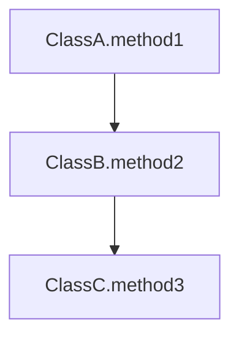

# Epic 3: 代码解析与上下文提取

**用户价值**：系统能够解析 Git 代码差异、获取完整文件内容、检测编程语言并分析调用链路，为 AI 审查提供丰富的代码上下文。

**用户成果**：
- 解析 Unified Diff 格式的代码差异
- 通过 Git API 获取完整文件内容
- 自动检测编程语言（基于扩展名和内容特征）
- 生成 Java 代码的调用链路图（Phase 1: JavaParser）
- 提取变更的函数、类、模块信息

**覆盖的功能需求**：FR 1.3（代码解析与上下文提取）
**覆盖的非功能需求**：NFR 1（性能）
**覆盖的附加需求**：集成要求（Git API）、数据流要求

---

## Stories

### Story 3.1: 实现 Unified Diff 格式解析器

**用户故事**：
作为系统，
我想要解析 Git Diff 内容（Unified Diff 格式），
以便提取代码变更信息。

**验收标准**：

**Given** 审查任务已创建
**When** 解析 Diff 内容
**Then** 创建 DiffParser 类：
- parseDiff(String diffContent): List<FileDiff>
- FileDiff 包含：oldPath、newPath、changeType（ADD/MODIFY/DELETE）
- FileDiff 包含：List<Hunk>（变更块）
- Hunk 包含：oldStart、oldLines、newStart、newLines、lines

**And** 解析 diff header（--- a/file +++ b/file）
**And** 解析 hunk header（@@ -l,s +l,s @@）
**And** 识别变更行类型（+添加、-删除、 上下文）
**And** 处理二进制文件（Binary files differ）
**And** 处理文件重命名（rename from/to）
**And** 编写单元测试使用真实 Git Diff 示例
**And** 测试边界情况（空 Diff、大文件、特殊字符）

---

### Story 3.2: 实现 Git API 客户端（获取完整文件）

**用户故事**：
作为系统，
我想要通过 Git 平台 API 获取完整文件内容，
以便为 AI 审查提供完整上下文。

**验收标准**：

**Given** Diff 解析器已实现
**When** 需要获取完整文件
**Then** 创建 GitClientService 接口：
- getFileContent(repoUrl, commitHash, filePath): String
- getPlatform(): GitPlatform（GITHUB/GITLAB/CODECOMMIT）

**And** 实现 GitHubClient 使用 GitHub API：
- GET /repos/{owner}/{repo}/contents/{path}?ref={sha}
- 解码 Base64 内容

**And** 实现 GitLabClient 使用 GitLab API：
- GET /api/v4/projects/{id}/repository/files/{path}/raw?ref={sha}

**And** 实现 AWSCodeCommitClient 使用 AWS SDK：
- codecommit.getFile(repositoryName, filePath, commitSpecifier)

**And** 使用工厂模式根据平台选择客户端
**And** 配置 HTTP 超时（10 秒）
**And** 缓存文件内容到 Redis（TTL 5 分钟）
**And** 编写单元测试使用 Mock API 响应

---

### Story 3.3: 实现编程语言检测

**用户故事**：
作为系统，
我想要自动检测代码文件的编程语言，
以便选择合适的解析器和审查策略。

**验收标准**：

**Given** 文件路径或内容可用
**When** 执行语言检测
**Then** 创建 LanguageDetector 类：
- detectByExtension(String filePath): Language
- detectByContent(String content): Language
- Language 枚举：JAVA、PYTHON、JAVASCRIPT、TYPESCRIPT、GO、UNKNOWN

**And** 基于文件扩展名检测：
- .java → JAVA
- .py → PYTHON
- .js → JAVASCRIPT
- .ts → TYPESCRIPT
- .go → GO

**And** 扩展名不明确时使用内容特征检测：
- 查找语言特定关键字（package、import、def、const）
- 查找语言特定语法模式

**And** 无法检测时返回 UNKNOWN
**And** 编写单元测试覆盖所有支持语言
**And** 测试边界情况（无扩展名、混合内容）

---

### Story 3.4: 实现 Java 代码调用链路分析（JavaParser）

**用户故事**：
作为系统，
我想要分析 Java 代码的调用链路，
以便生成调用图供 AI 审查参考。

**验收标准**：

**Given** Java 文件内容已获取
**When** 执行调用链路分析
**Then** 集成 JavaParser 库依赖
**And** 创建 JavaCallGraphAnalyzer 类：
- analyze(String javaCode): CallGraph
- CallGraph 包含：List<CallEdge>
- CallEdge 包含：fromClass、fromMethod、toClass、toMethod、lineNumber

**And** 解析类定义和方法声明
**And** 识别方法调用表达式（MethodCallExpr）
**And** 解析方法参数和返回类型
**And** 处理继承和接口实现（符号解析）
**And** 输出 Mermaid 格式调用图：


**And** 性能测试标准（详细测试计划见 poc-javaparser-performance.md）：

**性能目标（p95）**:
| 代码规模 | 总处理时间 | 内存使用 | 调用图准确率 | 验收标准 |
|---------|-----------|---------|------------|---------|
| 100 行 | < 1 秒 | < 50 MB | ≥ 95% | ✅ 必须达标 |
| 500 行 | < 3 秒 | < 150 MB | ≥ 95% | ✅ 必须达标 |
| 1000 行 | < 5 秒 | < 300 MB | ≥ 90% | ✅ 必须达标（NFR对齐）|
| 5000 行 | < 20 秒 | < 1 GB | ≥ 85% | ⚠️ 可选目标 |

**NFR 对齐**:
- NFR 要求"单次审查 < 30s per 100 lines"
- 调用图分析占总时间 ~10-15%
- 1000 行代码: 5s 调用图 + 23s AI 审查 + 2s 其他 = 30s ✅

**性能分解**:
```
Total Time (1000 lines): 5s
├── AST Parsing: 1s (20%)
├── Symbol Resolution: 2s (40%)
├── Call Graph Construction: 1.5s (30%)
└── Mermaid Generation: 0.5s (10%)
```

**And** 降级策略（如性能不达标）：

**策略 1: 部分调用图（推荐）**
- 触发条件: 处理时间 > 5s for 1000 lines 或 内存 > 500 MB
- 实现: 仅分析变更文件的局部调用图（2 层深度）
- 性能提升: 70-80%
- Trade-off: 缺少跨文件调用链（超过 2 层）

**策略 2: 禁用调用图**
- 触发条件: 总变更行数 > 2000 或 文件数 > 20
- 实现: 跳过调用图分析，返回占位消息
- 性能提升: 100%（节省 5s）
- Trade-off: 无调用图价值

**策略 3: 异步生成（Phase 2 增强）**
- 实现: 先返回审查结果（无调用图），后台异步生成
- 通知: WebSocket 实时推送调用图完成通知
- Trade-off: 需要额外的 WebSocket 基础设施

**And** 配置项：
```yaml
code-analysis:
  call-graph:
    enabled: true
    timeout: 10s  # 单个文件分析超时
    max-depth: 10  # 最大调用深度
    max-nodes: 500  # 最大节点数（防止内存溢出）
    performance-threshold:
      max-time-ms: 5000  # 超过 5s 触发降级
      max-memory-mb: 500  # 超过 500MB 触发降级
    degradation-mode: partial  # partial / disabled
```

**And** 监控指标：
- `callgraph.analysis.latency` - 调用图分析耗时
- `callgraph.analysis.accuracy` - 准确率（对比预期结果）
- `callgraph.degradation.rate` - 降级触发率

**And** 编写单元测试使用示例 Java 代码：
- 测试简单场景（单类、单方法调用）
- 测试中等场景（3-5 个类、10-20 个方法）
- 测试复杂场景（递归调用、重载方法、继承多态）

**And** 性能基准测试（使用 JMH）：
```java
@Benchmark
@BenchmarkMode(Mode.AverageTime)
@OutputTimeUnit(TimeUnit.MILLISECONDS)
public CallGraph benchmarkCallGraphAnalysis() {
    return analyzer.analyze(javaCode1000Lines);
}
```

**And** 准确率验证测试：
- 使用已知开源项目代码（Spring Boot, Apache Commons）
- 手动标注预期调用关系（ground truth）
- 计算准确率 = 正确识别的调用 / 总调用数
- 目标: Precision ≥ 90%, Recall ≥ 90%

**And** 边界测试：
- 空类（无方法）
- 超大类（100+ 方法）
- 循环依赖（A → B → A）
- 第三方库调用（仅记录，不深入分析）

**And** 明确 Phase 1 限制（文档化）：
- ⚠️ Phase 1 仅支持 Java 语言
- ⚠️ 不支持跨项目依赖分析
- ⚠️ 第三方库调用仅记录调用点，不分析库内部
- 📅 Phase 2 计划: 集成 Tree-sitter 支持多语言（Python, JavaScript, Go）

---

### Story 3.5: 实现代码上下文提取服务

**用户故事**：
作为系统，
我想要提取代码变更的完整上下文，
以便为 AI 审查提供丰富的信息。

**验收标准**：

**Given** Diff 解析、文件获取、语言检测、调用链路分析已实现
**When** 为审查任务提取上下文
**Then** 创建 CodeContextService：
- extractContext(ReviewTask task): CodeContext
- CodeContext 包含：
  - List<FileChange>（文件变更）
  - Map<String, String> fullFileContents（完整文件）
  - Map<String, Language> languages（语言映射）
  - Map<String, CallGraph> callGraphs（调用图）

**And** 对每个变更文件：
- 解析 Diff 提取变更行
- 获取完整文件内容
- 检测编程语言
- 如果是 Java，生成调用链路图

**And** 提取变更的函数/类信息
**And** 计算变更统计（添加行数、删除行数）
**And** 处理大文件（> 1000 行）时仅提取变更周围的上下文（±20 行）
**And** 将上下文存储到 `review_task` 表的 JSONB 列
**And** 编写集成测试使用真实 Git 仓库

---
